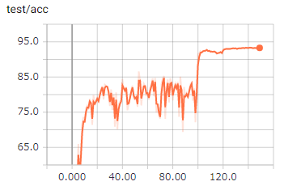
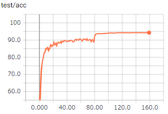
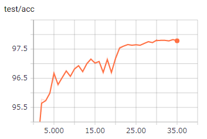

# CIFAR10 Benchmark in PyTorch
Easy-to-run model benchmark on CIFAR10.

With this repository you can:
- train VGG[1], ResNet[2], and EfficientNet[3] series
- manage training conditions using [YACS](https://github.com/rbgirshick/yacs) configs
- plot the results on tensorboard 
- build environment using docker 

So far you cannot:
- train models on ImageNet
- train models using multiple GPUs
- load tensorflow weights

### What's New
- Verified test accuracy of VGG16, ResNet18 and EfficientNetB0
- Verified that EfficientNetB0-B7 successfully works with ImageNet-pretrained weights

## Benchmark Results

RandomCrop and LRFlip are used for data augmentation.

### From Scratch
Input size is 32x32.
<table><tbody>
<tr><th>VGG16: 93.3 %</th><th>ResNet18: 94.3%</th></tr>
<tr><th> </th><th>
</th></tr>
</table></tbody>

### Transfer Learning
Finetuning ImageNet-pretrained models on CIFAR10.  
Input size during training is 224x224.
<table><tbody>
<tr><th>EfficientNet B0: 97.8 % ([3]: 98.1%)</th></tr>
<tr><th> </th></tr>
</table></tbody>
If you wish to train EfficientNet models from scratch, simply drop `MODEL.PRETRAINED` from your config.

## Getting Started

### Prerequisites: 
- Python 3.6+
- PyTorch 1.0+
- (optional) tensorboardX

### Using Docker 

```bash
$ nvidia-docker build -t cifar10_pytorch --build-arg UID=`id -u` -f docker/Dockerfile .
$ docker run -it -v `pwd`:/work --name cifar10_pytorch_container cifar10_pytorch
```

## Training on CIFAR10

You can select a model to train by specifying a config file.  
```bash
$ python train.py --help
usage: train.py [-h] [--config CONFIG] [--tfboard TFBOARD]
                [--checkpoint_dir CHECKPOINT_DIR] [--resume RESUME]

optional arguments:
  -h, --help       show this help message and exit
  --config CONFIG  path to config file
  --tfboard TFBOARD  tensorboard path for logging
  --checkpoint_dir CHECKPOINT_DIR
            directory where checkpoint files are saved
  --resume RESUME       checkpoint file path
```

example:

```bash
$ python train.py --config configs/vgg16.yaml --tfboard out
```

## TODOs

Models
- [ ] MobileNet v3
- [ ] MobileNet v2
- [ ] ResNet Transfer Learning

Data augmentation
- [ ] CutMix
- [ ] CurOut
- [ ] Manifold Mixup

Others
- [ ] CIFAR100
- [ ] pip installer
- [ ] multiple GPU training
- [ ] instruction of models

## References
[1] K. Simonyan and A. Zisserman, "Very Deep Convolutional Networks for Large-Scale Image Recognition" [paper](https://arxiv.org/abs/1409.1556)  
[2] K. He, X. Zhang, S. Ren, J. Sun, "Deep Residual Learning for Image Recognition" [paper](https://arxiv.org/abs/1512.03385)  
[3] M. Tan and Q. V. Le, "EfficientNet: Rethinking Model Scaling for Convolutional Neural Networks" [paper](https://arxiv.org/abs/1905.11946)  
[4] [pytorch-cifar](https://github.com/kuangliu/pytorch-cifar)  
